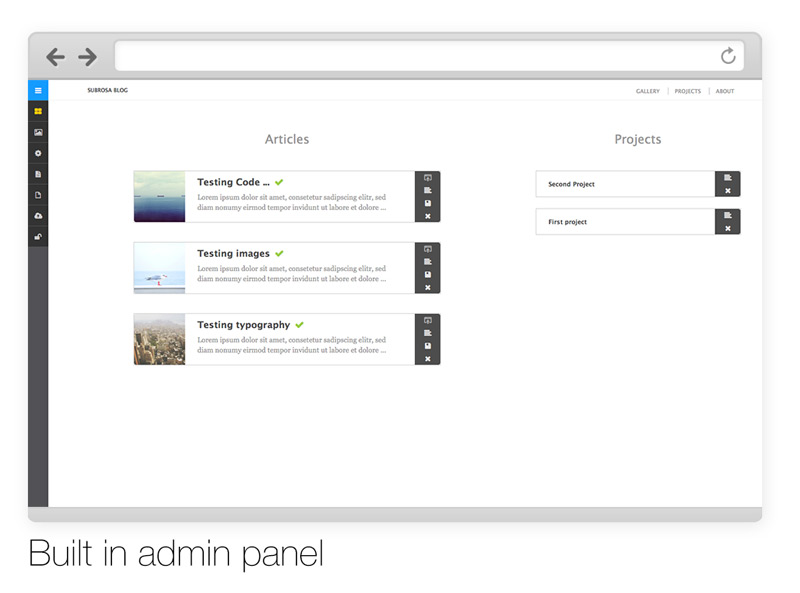
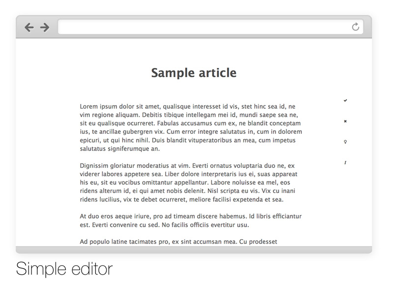

# Subrosa

v.0.3

You can see working example under [konradwasowicz.com/subrosa](http://konradwasowicz.com/subrosa)

Subrosa is simple and elegant blogging platform written in Python, meant to be easy to use and deploy. Features:

* Supported Python versions: 2.6, 2.7, 3.3, 3.4
* Supported databases: MySQL, PostgreSQL, SQLite
* Autogenerated table of contents for each article
* Code highlighting via Pygments
* Comments via Disqus
* Responsive layout
* RSS Channel
* IE9+ compatible
* Caching with no external dependencies

##### For installation and configuration instructions please refer to official documentation at [http://subrosa.readthedocs.org/en/latest/](http://subrosa.readthedocs.org/en/latest/)

## Software used

##### [Flask microframework](http://flask.pocoo.org/)
##### [Peewee ORM](https://github.com/coleifer/peewee)
##### [Flask-Cache](https://github.com/thadeusb/flask-cache)
##### [Python-Markdown](https://github.com/waylan/Python-Markdown)
##### [magnific-popup](http://dimsemenov.com/plugins/magnific-popup/)
##### [jquery-nested](http://suprb.com/apps/nested/)
##### [jquery-lazyload](http://www.appelsiini.net/projects/lazyload)
